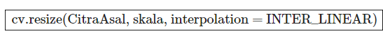

# Penskalaan Gambar (Resize)

Pernah ga sih sadar kalau gambar itu punya ukuran???
coba deh liat misalnya ada kamera yang memiliki sensor 12 MP mampu menangkap gambar 4000 x 3000 Pixels.
Sementara kamera 8 MP secara teoritis hanya mampu menangkap gambar 3840x2160 Pixels.

notes: pixel itu satuan yang dipakai dalam citra/gambar, digunakan umumnya untuk kamera dan display (monitor, LCD HP, Panel OLED, dsb)

- Gambar itu bisa diubah ukurannya
Misalnya sih gambar yang resolusinya 4K bisa kita turunkan atau resize ke resolusi 1080 pixels.
Bisa juga sebaliknya, gambar yang resolusi nya 1080 pixels bisa di resize ke ukuran yang lebih besar, tapi ya nanti hasilnya jadi pecah.

Sintaksnya:
 

Cara pertama
```python
img=cv2.imread('nama_file.jpg',cv2.IMREAD_COLOR)
print("Panjang",img.shape[0])
print("Lebar",img.shape[1])
b=cv2.resize(img,(1920,1080))
```
cara lain
```python
img = cv2.imread('nama_file.png')   
scale_percent = 60
width = int(img.shape[1] * scale_percent / 100) 
height = int(img.shape[0] * scale_percent / 100) 
dim = (width, height)   
```
3 Metode dalam penskalaan, nanti perbedaannya akan kita coba satu persatu.

# a. INTER NEAREST : Interpolasi nearest-neighbor.
Interpolasi jenis ini merupakan interpolasi paling sederhana. Dimana hasilnya diambil dari tetangga yang terdekat.
```python
img = cv2.imread("nama_file.png")
resized = cv2.resize(img, (100,100), interpolation=cv2.INTER_NEAREST)
```

# b. INTER LINEAR : Interpolasi bilinear (default)
Interpolasi jenis INTER LINEAR ini dihasilkan melalui sumbu x linear dan sumbu y linear.
```python

img = cv2.imread('nama_file.png')
resized = cv2.resize(img, (100,100), interpolation=cv2.INTER_LINEAR)

```

## c. INTER AREA : Melakukan resampling menggunakan relasi area piksel.
INTER AREA merupakan method yang lebih disarankan untuk digunakan karena ia memberikan hasil citra yang moire-free.

```python
img = cv2.imread("nama_file.png")
resized = cv2.resize(img, (100,100), interpolation=cv2.INTER_AREA)
```
